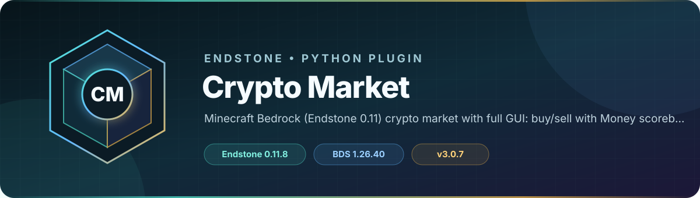

<!-- endstone-professional-header:start -->
<p align="center">
  
</p>

<p align="center">
  <a href="https://github.com/TheNINJALLO/endstone-crypto/actions/workflows/wheel-release.yml"></a>
  <a href="https://github.com/TheNINJALLO/endstone-crypto/releases/latest"></a>
</p>

<p align="center">
  
  
  
  =3.11" src="https://img.shields.io/badge/Python-%3E=3.11-3776AB?style=flat-square&amp;logo=python&amp;logoColor=white">
</p>

<p align="center">
  <strong>Minecraft Bedrock (Endstone 0.11) crypto market with full GUI: buy/sell with Money scoreboard, mining drops, P2P trading, charts.</strong>
</p>

<p align="center">
  <a href="#what-it-does">What it does</a> &bull;
  <a href="#how-to-use">How to use</a> &bull;
  <a href="#commands-and-permissions">Commands</a> &bull;
  <a href="#install">Install</a> &bull;
  <a href="https://github.com/TheNINJALLO/endstone-crypto/releases">Releases</a>
</p>

## Overview

Minecraft Bedrock (Endstone 0.11) crypto market with full GUI: buy/sell with Money scoreboard, mining drops, P2P trading, charts. This release is aligned with Endstone 0.11.8 and Minecraft Bedrock Dedicated Server 1.26.40, and is distributed as a Python wheel for direct installation in an Endstone server.

## What it does

- Adds a simulated crypto market backed by the server's `Money` scoreboard economy.
- Supports GUI buying, selling, portfolio views, charts, mining drops, and player-to-player trading.
- Provides operator controls for market behavior and persistent player holdings.

## How to use

1. Create or verify the `Money` scoreboard objective and review the generated market configuration.
2. Players run `/crypto` (or `/market` or `/coinswap`) and use `/crypto help` for the available market actions.
3. Use the GUI to buy or sell assets and review balances; grant the admin permission only for market controls.

## Commands and permissions

| Command / usage | What it does | Access |
|---|---|---|
| `/crypto [tail: message]`<br><sub>Aliases: `/market`, `/coinswap`</sub> | Crypto commands (/crypto help). | `endstone_crypto.command.crypto` |

## Compatibility

| Component | Supported version |
|---|---|
| Endstone | `0.11.8` |
| Endstone API | `0.11` |
| Bedrock Dedicated Server | `1.26.40` |
| Python | `>=3.11` |
| Plugin release | `v3.0.7` |

## Install

Download the wheel from the matching GitHub release:

```bash
gh release download v3.0.7 --repo TheNINJALLO/endstone-crypto --pattern "*.whl"
```

Copy the downloaded wheel into the server's `plugins/` directory, remove any older wheel for the same plugin, and restart Endstone.

> [!IMPORTANT]
> Use Endstone `0.11.8` with BDS `1.26.40`. Back up worlds and plugin data before upgrading a production server.

## Configuration and secrets

Runtime databases, logs, local `.env` files, server directories, and root `config.toml` files are excluded from source releases. When an example configuration is provided, copy it locally and keep live tokens, passwords, webhook URLs, and server identifiers out of Git.

## Release automation

Every `v*` tag runs [the wheel release workflow](.github/workflows/wheel-release.yml), builds the package in a clean GitHub runner, stores the wheel as a workflow artifact, and attaches it to the matching GitHub release.
<!-- endstone-professional-header:end -->

---

## Project guide

**Version:** 1.0.0  
**Endstone Compatibility:** 0.11.8+  
**Author:** TheN1NJ4LL0  


---

## ✨ Features
- 🎮 `/crypto` opens a full **market UI** (buy, sell, charts, portfolio).  
- 📉 Prices **fluctuate dynamically** over time (random walk w/ momentum).  
- ⛏️ Chance to earn crypto when breaking ores (depth-based bonus).  
- 💰 Trades use scoreboard objective `Money`.  
- 📊 Mini sparkline charts rendered in forms.  
- 🏦 Multiple Minecraft-themed coins (NINJ, DIAM, EMER, RED, OBSID).  
- ⚙️ Configurable via `config.toml` (auto-generated).  

---
